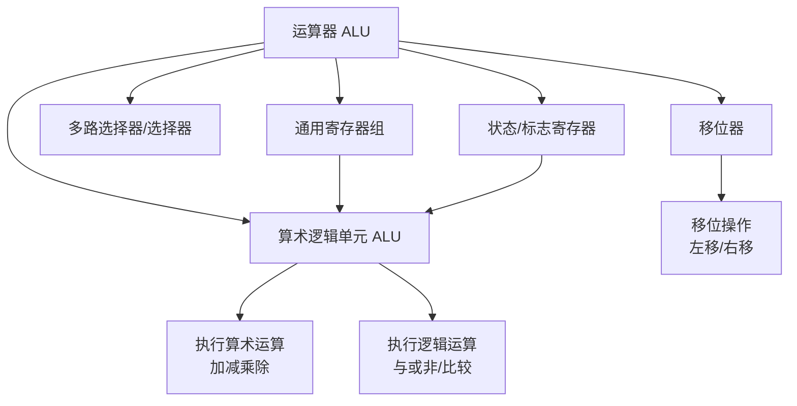
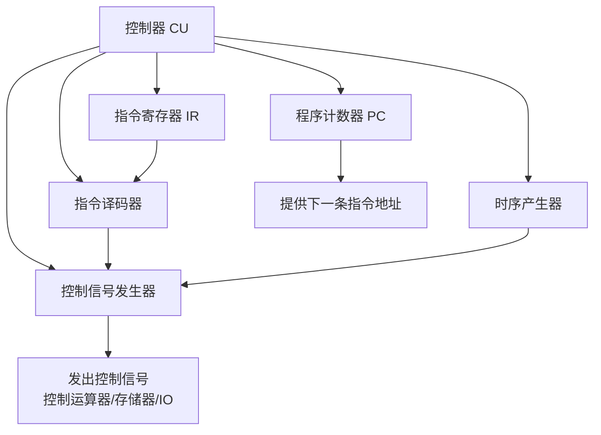
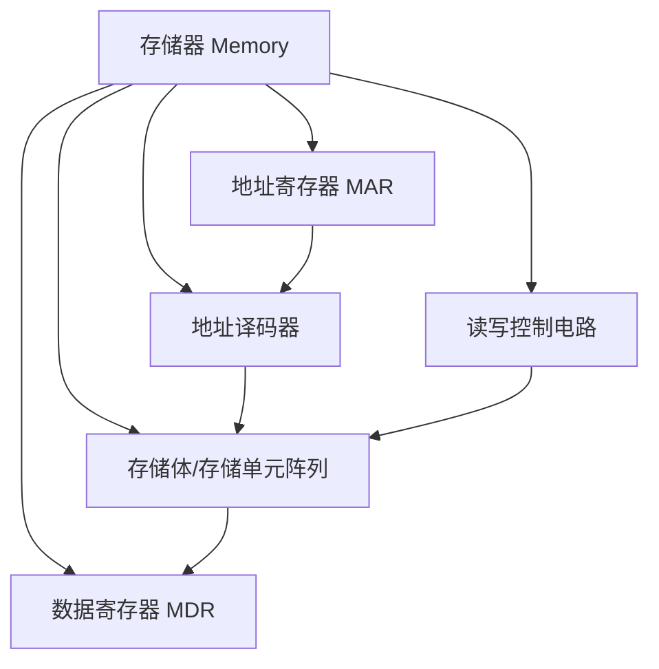
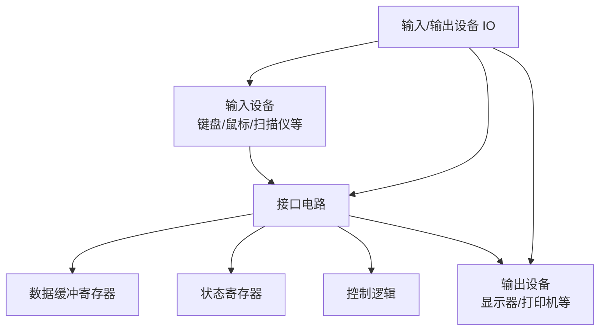
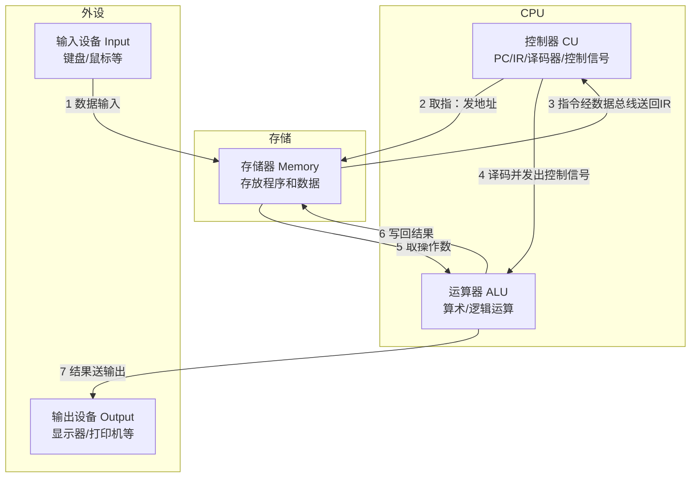
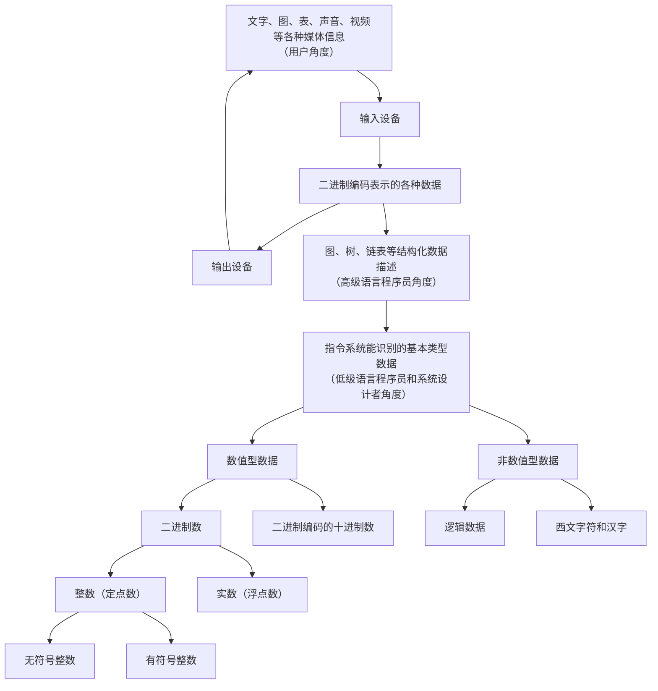
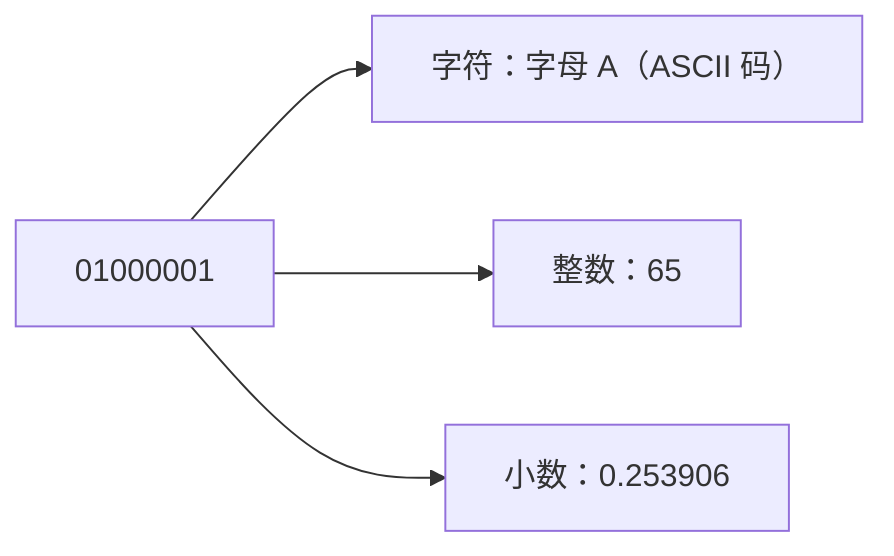
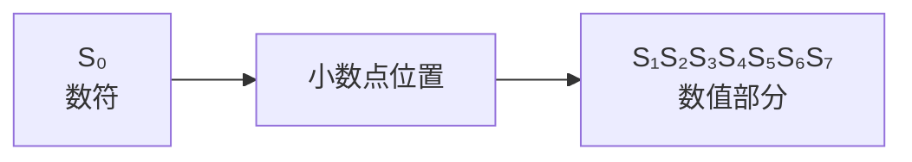
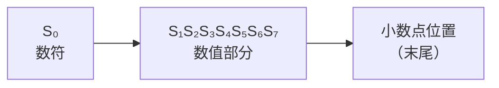
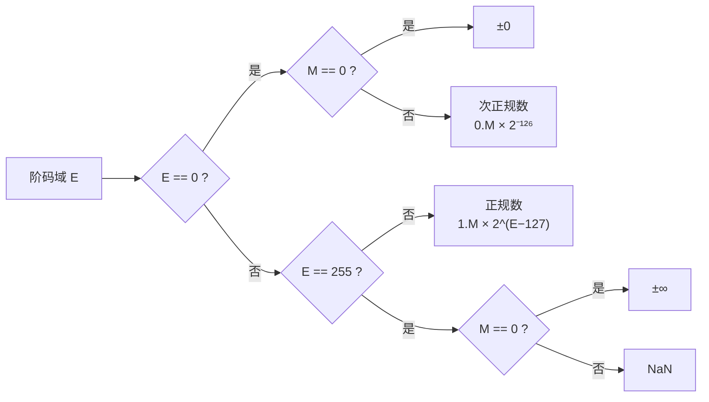

## 计算机系统的层次结构

### 课程介绍

| 序号 | 内容 | 学时数 |
|------|------|--------|
| 第一讲 | 计算机组成概述 | 4 |
| 第二讲 | 组合逻辑设计 | 6 |
| 第三讲 | 时序逻辑设计 | 6 |
| 第四讲 | 主存储器 | 5 |
| 第五讲 | 指令系统与汇编语言 | 4 |
| 第六讲 | MIPS 处理器设计 | 18 |
| 第七讲 | 高速缓存存储器 | 6 |
| 第八讲 | 虚拟存储系统 | 4 |
| 第九讲 | 外部存储与输入输出方式 | 3 |
| 习题 | 各部分习题课 | 4 |
| 复习 | 复习、答疑、机动 | 4 |

#### 各讲课程目标

**第一讲：计算机组成概述（4 学时）**

> 目标：了解计算机系统的基本功能、组成框架、典型结构及层次关系，掌握计算机中数的表示方法及常用编码。

**第二讲：组合逻辑设计（6 学时）**

> 目标：了解门电路的基本结构，掌握布尔代数的理论及其门电路实现方法，进而掌握布尔方程表示、转换及化简等方法，以及运算单元、译码器等基本组合逻辑部件设计方法，学习并掌握 Verilog HDL。

**第三讲：时序逻辑设计（6 学时）**

> 目标：掌握触发器、寄存器的结构和工作原理，掌握有限状态机、同步时序逻辑电路的设计方法和分析方法，具备使用仿真工具开发时序逻辑电路的能力。

**第四讲：主存储器（5 学时）**

> 目标：了解存储单元电路的工作原理，掌握主存储器的结构特点、工作原理和构造方法。

**第五讲：指令系统与 MIPS 汇编语言（4 学时）**

> 目标：以 X86 和 MIPS 两种指令系统为研究对象，学习并掌握计算机指令系统的格式、寻址方式和设计方法，理解 CISC 和 RISC 两种指令系统的特点；学习并掌握 MIPS 汇编语言编程。

**第六讲：MIPS 处理器设计（18 学时）**

> 目标：以小型 MIPS 处理器为研究对象，学习并掌握基于指令执行分析的数据通路构造方法、基于与或逻辑阵列为基础的 MIPS 控制器设计方法，进而掌握 MIPS 处理器设计方法。

**第七讲：高速缓存存储器（CACHE）（6 学时）**

> 目标：掌握高速缓存存储器（Cache）的结构特点和工作原理，以及多级 Cache 层次关系，掌握 Cache 的映射机制、Cache 的命中与缺失分析及其性能计算方法。

**第八讲：虚拟存储系统（4 学时）**

> 目标：掌握虚拟存储器工作原理、虚实地址转换与页表工作原理、TLB 工作原理，具备进行虚拟存储器性能分析的能力。

**第九讲：外部存储与输入输出方式（3 学时）**

> 目标：掌握程序查询 I/O、中断 I/O 和 DMA I/O 等输入输出方式的工作原理。

计算机系统从高层到低层呈现如下的层次结构：

>- *问题*
>- *算法*
>- *程序/语言*
>- *系统软件（os/compiler...）*
>- *软硬件接口（ISA）*
>- *微体系结构*
>- *逻辑*
>- *电路/装置*
>- *电子*

### 算法

> 算法：能够确保最终停止的一步一步执行的过程，每一步都能够被精确的表述并且能够由计算机执行。

算法需要满足的性质：

- **有限性**：算法必须在有限步内结束。
- **确定性**：每一步都有明确的、无歧义的定义。
- **有效可计算性**：每一步都能够被精确表述，并且能够由计算机执行。

> 同一个问题可以有多种算法。

### 各层含义

- **问题**：需要被求解的对象。
- **算法**：解决该问题的有限、确定、有效可计算的过程。
- **程序/语言**：用某种编程语言，把算法表述为可被计算机理解并执行的程序。
- **系统软件（OS/Compiler...）**：把程序转换为计算机可执行的形式（操作系统、编译器、汇编器等）。
- **软硬件接口（ISA）**：软件与硬件之间的接口。
- **微体系结构**：ISA 的具体实现。
- **逻辑**：微体系结构所使用的数字逻辑电路。
- **电路/装置**：由数字逻辑电路构成的、实现特定功能的单元或器件。
- **电子**：构成逻辑电路的电子器件。

### ISA（Instruction Set Architecture，指令集体系结构）

> ISA 是软件与硬件之间的接口/约定，是程序员认为硬件能满足的条件。

- 指令集体系结构（ISA）位于软件与硬件之间。
- 它规定了程序员能够看到、并假设硬件能够满足的条件。

### 微体系结构

> 微体系结构：某个 ISA 的一种实现。

### 数字逻辑电路

> 数字逻辑电路：微体系结构的构成要素（例如，门）。

### 电路/装置

> 电路/装置：由数字逻辑电路组合而成的、能够实现特定功能的单元或器件。

- 微体系结构中的各个部件（如运算器、控制器、寄存器、存储器等）本质上是由数字逻辑电路构成的“电路/装置”。
- 电路/装置位于“逻辑”与“电子”之间：它由逻辑门等基本逻辑元件组成，又由更底层的电子器件实现。
- 通过这些电路/装置，可以把抽象的 **逻辑** 转化为实际可工作的硬件部件，最终体现在 **电子** 层面。

### 为什么要有系统的概念（底层细节为什么重要？）

> 底层细节之所以重要，可以从四个典型例子看出：`int`/`float` 的类型差异、存储系统（存储器层次）的访问速度差异、循环内外层颠倒带来的性能差异，以及多核环境下因资源共享导致的性能下降。

## 计算机的基本组成

### 硬件（Hardware）
> 硬件的定义：计算机系统中所有的物理部件，包括电子器件、逻辑电路、微体系结构等。
### 软件（Software）
> 软件的定义：计算机系统中所有程序和数据的集合，包括操作系统、应用软件等。

### 计算机三个关键要素
- 计算
> 运算（运算器）
> 控制（控制器）
- 存储（内存）
> 存储器（主存储器、辅助存储器）
- 通信
> 输入/输出（I/O）设备

### 冯·诺依曼结构（von Neumann Architecture）

> 冯·诺依曼结构：由冯·诺依曼等人提出的一种计算机体系结构，核心思想是“**存储程序**”（stored-program），即把程序和数据一同存放在存储器中，由程序控制和驱动计算机自动工作。

#### 两个基本特征

- **存储程序**：把程序（指令序列）和数据**一同存放**在存储器中，计算机能自动、连续地取出并执行指令。
- **程序控制**：计算机在控制器的指挥下，依据存储的程序**自动、顺序地**执行指令，无需人工干预即可完成处理。

- **存储程序概念**：指令（程序）和数据都以二进制形式存放在同一种存储器中，计算机能够自动、连续地取出并执行指令。
- **五大基本部件**：
  - **运算器**：完成算术与逻辑运算。
  - **控制器**：取指、译码并发出控制信号，指挥各部件协调工作。
  - **存储器**：存放程序和数据。
  - **输入设备**：把程序和数据送入计算机。
  - **输出设备**：把处理结果送出计算机。

#### 结构特点

- **以运算器为中心**：早期的冯·诺依曼机以运算器为中心，输入/输出与存储器的数据交换都要经过运算器。
- **存储程序、程序控制**：程序和数据统一存放在存储器中，由控制器依据存储的程序自动、顺序地执行指令。
- **指令由操作码和地址码组成**：每条指令包含“做什么”（操作码）和“对谁做”（地址码）两部分信息。
- **按地址访问**：存储器按地址（单元编号）进行访问，数据以二进制编码表示。
- **指令顺序执行**：在无跳转或跳转指令的情况下，指令按存储器中的顺序逐条取出并执行。

#### 冯·诺依曼结构的主要缺点（瓶颈）

- **冯·诺依曼瓶颈（von Neumann bottleneck）**：由于指令和数据共用同一条存储总线（同一存储器），CPU 与存储器之间的数据传送成为性能瓶颈。
- 现代计算机通过**缓存（cache）**、**指令/数据分离（哈佛结构）**、**流水线**等对冯·诺依曼结构进行了改进。

#### 与“计算机三个关键要素”的关系

> 冯·诺依曼结构对应了计算机的三大关键要素：**计算**（运算器+控制器）、**存储**（存储器）、**通信**（输入/输出设备与控制总线）。

### 计算机的四个功能

计算机是处理信息的工具，其核心功能可以概括为四个方面：

1. **数据运算（处理）**：对数据进行算术运算（加、减、乘、除）和逻辑运算（与、或、非、比较等），这是计算机最核心的“计算”功能。
2. **数据存储**：在存储器中保存程序和数据，以便随时读取和写入。
3. **数据传输（通信）**：在 CPU、存储器与外部设备之间传送数据和指令。
4. **数据输入/输出**：接收外部信息（输入），并把处理结果送往外部（输出）。

> 计算机的“四个功能”与三大关键要素相对应：**计算**（数据运算）、**存储**（数据存储）、**通信**（数据传输、输入/输出）。

### 运算器：实现数据处理的部件

> 运算器（Arithmetic Logic Unit, ALU）是计算机中负责执行算术运算和逻辑运算的核心部件。它接收来自存储器或输入设备的数据，按照控制器发出的指令进行处理，并将结果返回存储器或输出设备。
>
> 运算器的结构组成：运算器通常由多个功能模块组成，包括算术逻辑单元、移位器、选择器等。

**运算器结构组成流程图：**

### 控制器：实现程序控制的部件
> 控制器（Control Unit, CU）是计算机中负责指挥和协调各部件工作的核心部件。它从存储器中取出指令，译码后发出控制信号，控制运算器、存储器和输入/输出设备的操作，实现程序的顺序执行。

**控制器结构组成流程图：**

### 存储器：实现数据存储的部件
> 存储器（Memory）是计算机中用于存放程序和数据的部件。它可以分为主存储器（RAM）和辅助存储器（如硬盘、SSD等）。主存储器用于临时存放正在运行的程序和数据，辅助存储器用于长期保存数据。
>
> 存储器的结构组成：存储器通常由多个存储单元组成，每个存储单元都有唯一的地址，用于存放数据或指令。

**存储器结构组成流程图：**

### 输入/输出设备：实现数据传输的部件
> 输入/输出设备（Input/Output Devices）是计算机中用于与外部环境进行数据交换的部件。输入设备将外部信息转换为计算机可处理的形式，输出设备将计算机处理结果转换为人类可理解的形式。

**输入/输出设备结构组成流程图：**

### 指令执行的数据流向（以五大部件为主体）

> 计算机由**运算器、控制器、存储器、输入设备、输出设备**五大部件构成，指令的执行过程就是数据在五大部件之间流动、被加工的过程。下图以五大部件为主体，展示指令执行时的数据流向。

#### 五大部件的数据流向说明

1. **数据输入**：**输入设备**把外部数据送入存储器/CPU，供后续处理。
2. **取指**：控制器（CU）中的 **PC** 给出下一条指令的地址，经**地址总线**送往**存储器**；存储器取出指令，经**数据总线**送回控制器的 **IR**，同时 PC 自动加 1。
3. **译码**：控制器对 **IR** 中的指令进行译码，分析出“操作码”（干什么）与“地址码”（数据在哪里）。
4. **取操作数**：控制器向存储器发出读地址，把所需数据从**存储器**取出，送入运算器（或暂存寄存器）。
5. **执行**：控制器向**运算器（ALU）**发出控制信号，运算器对操作数进行算术或逻辑运算。
6. **写回**：运算结果经数据总线写回**存储器**（或通用寄存器）。
7. **数据输出**：处理结果经**输出设备**送出，供人查看或保存。

> 在整个过程中，**控制器**负责“指挥”，**运算器**负责“加工”，**存储器**负责“存放”，**输入/输出设备**负责与外部交换数据；五大部件通过**总线**（地址、数据、控制）连接，共同完成指令的执行。

#### 数据流向总结

**数据输入 → 取指 → 译码 → 取操作数 → 执行 → 写回 → 数据输出** 的完整数据流向为：

1. **数据输入**：输入设备 → 存储器/CPU。
2. **取指**：控制器 PC → 地址总线 → 存储器 → 数据总线 → 指令寄存器 IR。
3. **译码**：控制器分析指令的“操作码”与“地址码”。
4. **取操作数**：控制器 → 存储器 → 运算器（或暂存寄存器）。
5. **执行**：控制器发控制信号 → 运算器 ALU 进行算术/逻辑运算。
6. **写回**：运算器 → 数据总线 → 存储器/通用寄存器。
7. **数据输出**：处理结果 → 输出设备。

### 计算机层次结构的演变
> **机器语言程序**是计算机最底层的程序形式，直接由二进制指令组成。随着计算机技术的发展，出现了**汇编语言**、**高级语言**等更高级的编程语言，使得程序设计更加方便和高效。

### 计算机总线结构
> 总线（Bus）是计算机中用于连接各部件并传输数据、地址和控制信号的通信通道。总线结构可以分为数据总线、地址总线和控制总线三种类型。单总线结构，多总线结构和分布式总线结构是常见的总线组织方式。

### 计算机中数的表示的基本问题

> 计算机中"数"的表示，可以从**用户角度**、**高级语言程序员角度**、**低级语言程序员与系统设计者角度**三个层面来理解。不同层面描述的数据形态不同，但最终都要归结为计算机能够识别的**二进制编码**。

#### 数据表示的层次结构

### 2.1 无符号数和有符号数

### 进位计数制

> **进位计数制**：计算机内部采用**二进制**，只有 **1 和 0** 两个数字。

### 数的表示要解决的问题

- **数的符号**：正数、负数、零。
- **数的形态**：整数、小数（**小数点的性质**）。
- **数的绝对值**。

> 同一串二进制编码（如 `01000001`），按不同方式解释会得到不同含义：

> **要点**：计算机中存储的只是 0/1 序列，其含义完全取决于**解释方式（编码/类型）**。这正是 C 语言中变量必须先定义类型（`char`、`int`、`unsigned`、`float`、`double`）才能使用的原因。

### 无符号数

- 数的编码中**所有位均为数值位**，没有符号位。
- **只能表示 $\ge 0$ 的整数**。
- **16 位无符号数**的表示范围：**0 ~ 65535**。
- 一般用在**全部是正数运算且不出现负值结果**的场合，例如**地址运算**。

### 有符号数

数的实例：$+0.1010110$，$-0.1101001$，$+1001.001$，$-1101101$

#### 机器数表示

**1. 数的正负问题：设符号位**

- **"0" 表示"正"，"1" 表示"负"**，符号位**固定为编码的最高位**。
- 需要区分**机器数**（实际存储的编码）与**真值**（数本身）。
- **真值 0 怎么办**：存在**正零**与**负零**两种表示。

**2. 小数点怎么办：固定小数点（即定点数）**

- **定点小数**：绝对值**小于 1**。
- **定点整数**：**没有小数部分**。

**3. 带有整数和小数部分的数怎么办：浮点数**

- 按**以 2 为基的科学计数法**表示。

> **C 语言中变量为什么要一定先定义类型才能使用？**
> 因为同一串二进制数的含义取决于**"类型"（解释方式）**，必须先定义类型（`char`、`int`、`unsigned`、`float`、`double`），才能确定如何解释与处理这串 0/1 序列。

#### 定点小数

- 格式：**$S_0$（数符/符号位）** + **$S_1S_2S_3S_4S_5S_6S_7$（数值部分）**，**小数点位置在 $S_0$ 之后**。
- 例如：`01100000` 是十进制的 **0.75**。

- 说明：符号位 $S_0$ 在最前，其后紧跟小数部分，**小数点固定在符号位与数值位之间**。

#### 定点整数

- 格式：**$S_0$（数符/符号位）** + **$S_1S_2S_3S_4S_5S_6S_7$（数值部分）**，**小数点位置在末尾**。
- 例如：`01100000` 是十进制的 **96**（$64+32$）。

---

### 2.2 定点数表示（定点整数与定点小数）

- **机器数表示及其表示范围**：**原码、反码、补码、移码**。
> 移码：数学定义：移码是将真值 x 加上一个固定的偏移量 K（通常 \(K = 2^n\)，其中 n 为数值位数）得到的无符号形式，即 \([x]_{\text{移}} = 2^n + x\)。
> 简便求法：在计算机的机内表示中，移码就是将对应补码的符号位取反（无论正数还是负数），0 变 1，1 变 0。
> 定点数分为**定点整数**与**定点小数**，其区别仅在于**小数点位置的约定**；实际存储中并不存在小数点，小数点是"隐含"的。

### 2.3 浮点数表示（浮点数的科学计数法表示）
> 浮点数表示：按**以 2 为基的科学计数法**表示，形式为：$(-1)^S \times M \times 2^E$
> 其中：
> - $S$ 是符号位（*sign*），0 表示正数，1 表示负数；
> - $M$ 是尾数（*exponent*,或称为有效数字），通常为规格化形式；
> - $E$ 是阶码(*mantissa*)，用于表示小数点的位置。
> 实例：$-0.1101 \times 2^3$，其中 $S=1$，$M=0.1101$，$E=3$。十进制表示为 $-1.101 \times 2^2 = -6.5$。

### 为什么需要浮点数

定点数的小数点位置是**隐含固定**的：

| 类型 | 小数点位置 | 能表示的范围 | 问题 |
|------|-----------|-------------|------|
| 定点小数 | 符号位之后 | $\lvert x \rvert < 1$ | 表示不了 $1000$ 这种大数 |
| 定点整数 | 末尾 | 只能表示整数 | 表示不了 $0.5$ 这种小数 |

> 而现实数据（物理量、科学计算）既要**很大/很小的范围**，又要**足够多的有效数字**。解决办法是借用十进制的科学计数法思想，把**小数点位置用阶码显式记录下来**——这就是浮点数。

#### 与定点数的本质区别

- **定点数**：数的**绝对精度**固定（同一位权固定），范围小、精度均匀。
- **浮点数**：数的**相对精度**固定（有效位数固定），范围极大，但**绝对精度随数值大小变化**。

> 例：单精度浮点中，$2 \times 10^{30}$ 的绝对误差可达 $10^{23}$ 量级，而 $1.0$ 附近的绝对误差只有 $10^{-7}$ 量级。

### 规格化

同一数值有无数种 $(M,E)$ 组合，必须约定唯一表示：

$$-6.5 = -110.1_2 = -1.101 \times 2^{2} = -0.1101 \times 2^{3} = -1101 \times 2^{-3}$$

> **规格化**：让尾数的**最高有效位为 1**，从而唯一确定表示。

- **IEEE 754 采用 $1.M$ 形式**：$1 \le \lvert M \rvert < 2$，最高位的 1 **隐含不存**（隐藏位 hidden bit），白得 1 位精度。
- **老教材（如唐朔飞）常用 $0.1xxx$ 形式**：规格化判据是 $\lvert M \rvert \ge 1/2$。

> 代价：$1.M$ 形式**无论如何都表示不出 0**，而且 0 附近精度急剧恶化 → 于是引入**次正规数**解决。

### 阶码用移码，尾数用原码

- **阶码**：本身是带符号数，但为了便于**比较阶的大小**（无需处理符号位），用**移码（偏置码）**存储。看到阶码域必须先减去偏置才是真值。
- **尾数**：用**原码**（符号由 $S$ 单独给出，尾数域只放绝对值），便于乘除运算。

### IEEE 754 编码格式

#### 位域划分

| 格式 | 总位宽 | 符号 $S$ | 阶码 $E$ 域 | 尾数 $M$ 域 | 偏置 |
|------|--------|---------|------------|------------|------|
| 单精度 float | 32 | 1 | 8 | 23 | 127 |
| 双精度 double | 64 | 1 | 11 | 52 | 1023 |
| 半精度 half | 16 | 1 | 5 | 10 | 15 |

> 位序（单精度，从高位到低位）：`S | E(8) | M(23)`

真值计算：

$$x = (-1)^S \times 1.M_2 \times 2^{\,E_{\text{域}} - \text{bias}}$$

> 阶码域有效范围：单精度 $1 \sim 254$（$0$ 与 $255$ 留作特殊值），对应真实阶 $E \in [-126, 127]$。

#### 特殊值编码

| 阶码域 | 尾数域 | 含义 |
|--------|--------|------|
| 0 | 0 | $\pm 0$ |
| 0 | $\ne 0$ | **次正规数**：$x = \pm\,0.M_2 \times 2^{-126}$（无隐含 1，用来逐步下溢到 0） |
| $1 \sim 254$ | 任意 | **正规数**：$x = \pm\,1.M_2 \times 2^{E-127}$ |
| 255 | 0 | $\pm\infty$（如 $1/0$） |
| 255 | $\ne 0$ | **NaN**，尾数最高位为 1 称 quiet NaN，否则称 signaling NaN |

> 这正是 IEEE 754 的高明之处：**不需要额外的异常状态位**，用阶码域的两个极端值就自然地表示 0、无穷、NaN 与次正规数。

### 十进制 ↔ 浮点：手算步骤

> **步骤**：① 十进制 → 二进制（整数除 2 取余、小数乘 2 取整）；② 写成 $\pm 1.\text{xxx} \times 2^{k}$ 的规格化形式；③ 阶码域 $= k + 127$；④ 小数点后 23 位补齐（不足补 0，超长按就近舍入）；⑤ 拼接后转十六进制。

**例 1：$-6.5$**

- $-6.5 = -110.1_2 = -1.101_2 \times 2^{2}$
- 阶码域 $= 2 + 127 = 129 = 10000001_2$
- 尾数域 $= 101$ 后补 20 个 0
- 结果：`1 10000001 10100000000000000000000` = **`0xC1D00000`**

**例 2：$0.75$**

- $0.75 = 0.11_2 = 1.1_2 \times 2^{-1}$
- 阶码域 $= -1 + 127 = 126 = 01111110_2$
- 结果：`0 01111110 10000000000000000000000` = **`0x3F400000`**

**例 3：$5.0$**

- $5.0 = 101_2 = 1.01_2 \times 2^{2}$，阶码域 $= 129$
- 结果：`0 10000001 01000000000000000000000` = **`0x40A00000`**

> **反推示例**：`0x40490FDB`（即 $\pi$ 的单精度值）：$S=0$，阶码域 $10000000_2 = 128 \Rightarrow E = 1$，尾数 $1.10010010000111111011011_2$，故 $x \approx 3.14159274$（真实 $\pi$ 为 $3.14159265\ldots$，误差来自 23 位截断）。

### 表示范围与精度

**单精度**

- 最大正规数：$(2 - 2^{-23}) \times 2^{127} \approx 3.4028 \times 10^{38}$
- 最小正规数：$2^{-126} \approx 1.1755 \times 10^{-38}$
- 最小次正规数：$2^{-149} \approx 1.4013 \times 10^{-45}$
- 有效十进制位数：$\log_{10} 2^{24} \approx 7.22$ → **约 7 位有效数字**
- 机器 epsilon（$1.0$ 附近的相邻间隔）：$2^{-23} \approx 1.19 \times 10^{-7}$

**双精度**

- 最大正规数：$\approx 1.7977 \times 10^{308}$
- 最小正规数：$2^{-1022} \approx 2.2251 \times 10^{-308}$
- 有效十进制位数：$\log_{10} 2^{53} \approx 15.95$ → **约 16 位有效数字**
- 机器 epsilon：$2^{-52} \approx 2.22 \times 10^{-16}$

> **结论**：位宽增加时，**阶码加宽扩展范围，尾数加宽提高精度**。这也是数值计算中"用 `double` 比 `float` 稳"的原因。

### 浮点运算流程（以加减法为例）

1. **对阶**：把阶码小的数的尾数右移（每右移 1 位阶码 +1）直到阶码相等。**必须小阶向大阶对齐**（若反过来会把大数的高位丢掉）。右移出的低位不能直接扔，要保留为附加位参与后续舍入。
2. **尾数运算**：按定点数规则加减（用补码处理符号）。
3. **规格化**：
   - 结果最高位不是 1 → **左规**，尾数左移、阶码减小（可能连续多次）。
   - 尾数相加产生进位溢出（如 $1.xxx + 1.xxx$）→ **右规**，尾数右移 1 位、阶码 +1。
4. **舍入**：IEEE 754 默认**就近舍入到偶数**（round to nearest, ties to even），另有向零、向 $+\infty$、向 $-\infty$ 三种，由舍入模式控制。
5. **溢出判断**：阶码超上界 → **上溢**（溢出，通常给 $\pm\infty$）；阶码低于下界 → **下溢**（按次正规数或 0 处理）。

> **乘法/除法**：阶码相加/相减（注意偏置的重复计算，相减时只需减一次偏置），尾数相乘/相除，再规格化与舍入。乘法**不存在"对阶"步骤**。

### 精度陷阱

#### 十进制小数大多无法精确表示

$$0.1 = 0.00011001100110011\ldots_2 \quad (\text{无限循环})$$

必须截断：

- `float` 的 $0.1$ = `0x3DCCCCCD`
- `double` 的 $0.1$ = `0x3FB999999999999A`

> 所以 C/Python 中 `0.1 + 0.2 != 0.3`（结果约为 $0.30000000000000004$）。
> **判断浮点相等不要用 `==`，要用 $\lvert a - b \rvert < \varepsilon$。**

#### 灾难性抵消（catastrophic cancellation）

两个相近的大数相减会丢掉有效位：$10^{8} + 1.0$ 在单精度下仍是 $10^{8}$（1 被舍掉，因为 $10^8$ 附近的间隔约为 $2^{26} \times 2^{-23} = 8$）。

> 用求根公式解 $x^2 + 1000x + 1 = 0$ 也属此类问题，需改用数值稳定形式。

#### 结合律不成立

浮点加法**不满足结合律**：$0.1 + 0.2 + 0.3$ 与 $0.3 + 0.2 + 0.1$ 的结果可能不同；并行归约（如 GPU 上）因此结果不确定。这也是编译器默认**不允许**把 `(a+b)+c` 重排为 `a+(b+c)` 的原因。

#### 与整数转换

`int → float` 时，超过 $2^{24}$ 的整数（单精度）会丢精度；`float → int` 只截断不舍入，且超出范围是未定义行为。

### 浮点与整型的比较

> "哪个能表示的数更多"取决于"多"指什么：

| 解读 | 谁更多 | 对比（均取 32 位） |
|------|--------|-------------------|
| 不同取值的**个数** | 整型略多 | 一个 32 位寄存器只有 $2^{32}=4.295\times10^{9}$ 种状态，这是物理上限。`float32` 还要用 $\pm 0$ 与 NaN 占掉 $1.68\times10^{7}$ 个编码，实际可区分 $4.278\times10^{9}$ 个值，**少 0.39%** |
| 数值**范围** | 浮点胜 | 浮点 $10^{\pm 38}$，整型仅 $10^{\pm 9.6}$ |
| 能精确表示的**整数个数** | 整型胜 | `int32` 覆盖 $[-2^{31},2^{31}-1]$ 内**全部**整数；`float32` 只有 $\lvert n\rvert \le 2^{24}$ 内是全部整数，合计约 $1.78\times10^{9}$ 个，约为 `int32` 的 $1/2.4$ |

- **根本原因**：位宽决定信息量上限（$\le 2^{\text{位宽}}$），编码方式只决定信息如何分配。浮点并没有"凭空多表示数"，只是把同样的格点从**均匀铺在小范围**改成**按 2 的幂对数铺满大范围**。
- **分布差异**：整型**等间距**（绝对精度恒为 1）；浮点每个 binade $[2^k,2^{k+1})$ 内有 $2^{23}$ 个格点、间隔 $2^{k-23}$（相对精度恒约 7 位十进制，靠近 0 处极密、远离 0 处极疏）。
- **实践**：地址、计数、位运算用整型；物理量与科学计算用浮点；需要精确相等、货币计算、大整数累加的场合不要用浮点。

### 与 MIPS 的关联

- MIPS 中浮点由**协处理器 1（COP1）**执行，有独立的浮点寄存器 `$f0`–`$f31`（32 个 32 位寄存器）。
- 单精度用 1 个寄存器，**双精度用相邻的一对偶数号寄存器**（如 `$f0,$f1` 存一个 `double`）。
- 常用指令：

| 类别 | 指令 | 说明 |
|------|------|------|
| 访存 | `lwc1` / `swc1` | 装载/存储单精度 |
| 访存 | `ldc1` / `sdc1` | 装载/存储双精度 |
| 运算 | `add.s` `sub.s` `mul.s` `div.s` | 单精度加减乘除（后缀 `.d` 为双精度） |
| 转换 | `cvt.s.w` | 字 → 单精度 |
| 转换 | `cvt.w.s` | 单精度 → 字（默认用截断） |
| 比较/分支 | `c.eq.s` `c.lt.s` `c.le.s` + `bc1t` / `bc1f` | 条件码存入 FP 控制状态寄存器，再据此跳转 |

> 这也解释了为什么 MIPS 把浮点单独放在 COP1：**整数数据通路无法直接复用来做对阶、规格化和舍入**，需要额外的阶码运算与移位逻辑，硬件代价大，故做成独立部件。

### 一页速查

| 概念 | 要点 |
|------|------|
| 形式 | $x = (-1)^S \times 1.M \times 2^{E-\text{bias}}$ |
| 单精度 | `S(1) E(8) M(23)`，bias 127 |
| 双精度 | `S(1) E(11) M(52)`，bias 1023 |
| 隐含位 | $1.M$ 中的 1 不存，多出 1 位精度 |
| 特殊值 | $E$ 全 0 且 $M$ 全 0 → $\pm 0$；$E$ 全 0 且 $M \ne 0$ → 次正规数；$E$ 全 1 → $\pm\infty$ / NaN |
| 精度 | 单精度约 7 位十进制，双精度约 16 位 |
| 范围 | 单精度约 $10^{\pm 38}$，双精度约 $10^{\pm 308}$ |
| 运算五步 | 对阶 → 尾数运算 → 规格化 → 舍入 → 判溢出 |
| 主要坑 | $0.1$ 不可精确表示、相减抵消、结合律失效 |
| 对比整型 | 同宽度下取值个数几乎相同；浮点赢在范围，整型赢在精度与精确整数个数 |

### 非数值数据的表示
> 非数值数据包括逻辑数据、字符数据、图像数据等。计算机中所有信息最终都要转换为二进制编码进行存储和处理。
> 逻辑数据：用 0/1 表示真假，通常用 1 位表示一个逻辑值。
> 字符数据：计算机中字符的表示通常采用 ASCII 码或 Unicode 编码。ASCII 码使用 7 位或 8 位二进制数表示字符，Unicode 码则使用更多位数以支持全球各种文字。
> 西文字符：通常使用 ASCII 码表示，范围为 0~127（7 位），包括英文字母、数字、标点符号等。
> 汉字编码：输入码、国标码、区位码、GB2312、GBK、GB18030、Unicode 等都是汉字编码的不同方式。
> 常用校验码：奇偶校验码、CRC 校验码、汉明码等，用于检测和纠正数据传输或存储中的错误。

# 计算机的工作过程
### 机器指令
> 机器指令是计算机能够直接识别和执行的指令，由操作码和操作数两部分组成。操作码指定要执行的操作类型，操作数指定参与运算的数据或数据的存储位置。机器指令通常以二进制形式存储在计算机的存储器中。
### 程序
> 程序是由一系列机器指令组成的有序集合，用于完成特定任务。程序可以用高级语言编写，然后通过编译器或解释器转换为机器指令，最终在计算机上执行。
> **程序计数器 Program Counter，PC**是计算机中用于存储下一条将要执行的指令地址的寄存器。每当一条指令被取出并执行后，程序计数器会自动更新为下一条指令的地址，从而保证程序按顺序执行。 
## 指令执行过程
### 微操作
> 微操作是计算机中最基本的操作单位，通常由控制信号触发，用于完成特定的硬件操作，如数据传输、算术运算、逻辑运算等。微操作是指令执行过程中各个阶段的具体操作步骤。

## 组合逻辑
### 逻辑代数基础
#### 逻辑代数基本概念
> - 逻辑代数是研究逻辑运算规律的数学分支，主要用于分析和设计数字电路。逻辑代数的基本概念包括逻辑变量、逻辑函数、逻辑运算等。逻辑变量通常表示为二进制值（0 或 1），逻辑函数是由逻辑变量通过逻辑运算得到的输出结果。    
> - 布尔代数是逻辑代数的一种形式，由英国数学家乔治·布尔提出。布尔代数的基本运算包括与（AND）、或（OR）、非（NOT）等，广泛应用于计算机科学和电子工程领域。
> - 逻辑常量：逻辑常量是逻辑代数中的固定值，通常表示为 0 或 1。逻辑常量用于表示逻辑运算中的恒定输入或输出状态。在数字电路中，逻辑常量可以用于控制信号的设置或作为特定条件的判断依据。
> - 逻辑变量：逻辑变量是逻辑代数中的基本元素，通常表示为二进制值（0 或 1）。逻辑变量可以表示不同的逻辑状态，如真（1）和假（0）。在数字电路中，逻辑变量用于表示输入信号和输出信号的状态。
> - 逻辑函数：逻辑函数是由逻辑变量通过逻辑运算得到的输出结果。逻辑函数可以表示为真值表、逻辑表达式或逻辑图等形式。在数字电路中，逻辑函数用于描述输入信号与输出信号之间的关系。
#### 逻辑代数的运算法则
#### 逻辑函数的表达式
#### 逻辑函数的化简
### 逻辑门电路
#### 晶体管和MOS管
#### 逻辑门电路实现
