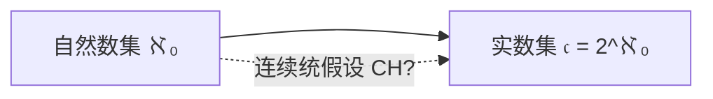

# 离散数学 —— 集合论-20260907

## 一、集合论的产生与发展

### 1. 朴素集合论（康托，Cantor）

### 2. 罗素悖论（数学的第三次危机）

### 3. 公理集合论（策梅洛，Zermelo）

## 二、问题思考

以下问题引出无穷集合的核心性质，是学习集合论的关键切入点。

### 问题 1：无穷集合是什么？

- **集合论的根本问题**。
- 一个集合若与自身的某个**真子集**之间存在一一对应，则称为**无穷集合**（戴德金无穷）。
- 即：无穷集合可以"整体与部分等量"。

### 问题 2："整体大于部分" 或 "整体在数量上多于部分" 在无穷集合中是否成立？

- **答案：不成立。**
- 在有限集合中，整体必然大于部分；但在无穷集合中，**整体可以与其真子集一一对应**，数量上"相等"。

### 问题 3：正整数集与实数集能否一一对应？（康托-戴德金问题）

- **答案：不能。**
- 康托用**对角线法**证明：实数集（特别是区间 $(0,1)$）是不可数的，其基数大于自然数集的基数。
- 自然数集可数，实数集不可数。

### 问题 4：平面点和直线点能否一一对应？（康托问题）

- **答案：能。**
- 康托证明了**平面上的点与直线上的点可以一一对应**，即它们的基数相同（均为连续统的势 $\mathfrak{c}$）。这一结论在当时非常反直觉。

### 问题 5：希尔伯特旅店问题

- 设想一家旅馆有**无限多个房间**，且已全部住满。
- **问：是否新来的客人仍能入住？**
- **答案：能。** 旅店老板只需让每位住客搬到编号加一的房间（$n \to n+1$），即可腾出 $1$ 号房给新客。
- 这直观地说明了无穷集合可以与自身的真子集等量，也体现了"无限"与"有限"的本质区别。
- 即使**再来无限多**客人，也能通过编排放置（如奇偶号房间分配）继续入住。

### 问题 6：无穷集合是否有大小（势）之分？自然数是最大无穷集吗？实数集比自然数大吗？它们之间是否还有其他无穷集？

- **无穷集合有大小之分**，用**势（基数）**衡量。
- 自然数集是最小的无穷集，其势记为 $\aleph_0$（阿列夫零）。
- **实数集比自然数集大**，其势为 $\mathfrak{c}=2^{\aleph_0}$，根据康托定理，$\mathfrak{c}>\aleph_0$。
- **连续统假设（Continuum Hypothesis, CH）**：是否存在一个集合，其势严格介于 $\aleph_0$ 与 $\mathfrak{c}$ 之间？
  - 康托提出猜想：**不存在**这样的集合（即 $\mathfrak{c}=\aleph_1$）。
  - 1940 年 **哥德尔** 证明 CH 与 ZFC 相容；1963 年 **科恩（Cohen）** 证明 CH 的否定也与 ZFC 相容。
  - 结论：**CH 在 ZFC 公理系统下不可判定**，是独立于 ZFC 的命题。



---

## 三、实数集与自然数集不能一一对应（对角线法）

### 命题

自然数集合与 $(0,1)$ 上的点**不能**一一对应，即实数集**不可数**。

### 证明思路（康托对角线法）

假设自然数集合与 $(0,1)$ 上的点一一对应，则可以把 $(0,1)$ 中所有实数以十进制小数形式列出来：

$$
\begin{aligned}
a_0 &= 0.a_{00}\,a_{01}\,a_{02}\cdots\\
a_1 &= 0.a_{10}\,a_{11}\,a_{12}\cdots\\
&\vdots\\
a_n &= 0.a_{n0}\,a_{n1}\,a_{n2}\cdots a_{nn}\cdots\\
&\vdots
\end{aligned}
$$

### 构造新数 $b$

构造

$$
b = 0.b_{00}\,b_{11}\,b_{22}\,b_{33}\cdots,\qquad b_{ii} \neq a_{ii},\quad i = 0,1,2,\dots
$$

即：令 $b$ 的第 $i$ 位小数，**不同于**上面序列中第 $i$ 个数 $a_i$ 的第 $i$ 位小数。

### 结论

- $b$ 与上面序列中的任一数 $a_i$ 都不同（至少在第 $i$ 位上不同），故 $b$ 不在该序列中。
- 这与"$(0,1)$ 中所有实数都被列出"相**矛盾**。
- 因此假设不成立，**$(0,1)$ 不可数**，实数集与自然数集**不能**一一对应。

---

## 四、平面点与直线点一一对应（康托问题）

### 背景

- **1874 年 1 月**，康托在写给**戴德金**的信中问道：**区间**和**正方形**两个点的集合能否构成**一一对应**的关系？
- **1877 年**，康托证明了：**平面上的点与直线上的点可以建立一一对应**。

### 构造方法（例）

例：$(0,1)$ 与**单位正方形**之间存在一一对应关系。

以数 $0.75146897\cdots$ 为例：

- 把**奇数位**、**偶数位**分别取出，得到两个新的数：
  - $0.7169\cdots$（奇数位）
  - $0.5487\cdots$（偶数位）
- 将以上两数分别作为**横坐标**和**纵坐标**，得到的点即落在**单位正方形**中。
- 反之，也可把正方形中点的坐标各位**交错**合并，还原成一个 $(0,1)$ 中的数，同样可构造。

### 推广

一般的 **$n$ 维空间**中的点也可以和**直线**建立一一对应。

> **意义**：直线、平面乃至 $n$ 维空间中点的"数量"（势）都相同，均为连续统的势 $\mathfrak{c}$。这也说明"维度"与"集合基数"是两个不同的概念。

---

## 五、可数集与不可数集

**1874 年**康托提出"**可数（列）集**"的概念，并以**与自然数集合一一对应**为原则，对无穷集合进行分类。

### 可数集（与自然数集等势，基数 $\aleph_0$）

- 自然数集 $\mathbb{N}$
- 代数数集
- 有理数集 $\mathbb{Q}$

> 这些集合彼此**基数相等**（可数集之间基数相同）。

### 不可数集（与自然数集不等势，基数大于 $\aleph_0$）

- 超越数集
- 实数集 $\mathbb{R}$
- 任意 $n$ 维空间上的点的集合

> 这些集合彼此**基数相等**（均与 $\mathbb{R}$ 等势，基数 $\mathfrak{c}$）。

---

## 六、集合论主要内容及关联

| 集合 | 关系 | 函数 | 基数 |
| --- | --- | --- | --- |
| 集合的定义<br/>(部分)列举法、抽象法、归纳定义 | 关系的定义、关系的相等<br/>关系的表示：矩阵表示、图表示 | 函数的定义<br/>部分函数、全函数 | 自然数的定义<br/>集合的后继<br/>自然数的归纳定义<br/>冯·诺依曼自然数系统 |
| 集合的关系<br/>相等、包含、子集 | 关系的性质<br/>(反)自反、(反)对称、传递 | 函数的性质<br/>单射、满射、双射 | 自然数的性质<br/>数学归纳法<br/>自然数的归纳定义进行证明 |
| 集合的运算<br/>$\cup,\cap,-,\oplus$ | 关系的运算<br/>作为集合的运算、逆/合成运算<br/>自反(对称、传递)闭包 | 函数的运算<br/>函数的合成、逆函数<br/>运算下是否满足函数性质 | 无限集合等势<br/>抽屉原理不再成立；希尔伯特旅馆<br/>基数大小：满(单)射<br/>等势：存在双射 |
| 有穷集的计数<br/>容斥原理、抽屉原理 | 序关系<br/>偏序、全序、拟序、良序 | 特征函数 | 可数集：与自然数集等势<br/>等势集合：$2^{\mathbb{N}},\mathbb{R},[0,1],(0,1)$<br/>$\#A<\#2^A$ |
| 有序偶、笛卡尔积 | 等价关系、划分 |  |  |

---

# 第一章 集合的基本概念及其运算

## 本章目录

- **1.1** 集合与元素
- **1.2** 集合间的相等和包含关系
- **1.3** 幂集
- **1.4** 集合的运算
- **1.5** 有穷集的计数原理
- **1.6** 集合的归纳定义法
- **1.7** 有序偶和笛卡尔乘积

---

## 1.1 集合与元素

### 集合的定义

> 集合是**人们能够明确区分**的一些**对象（客体）**构成的**一个整体**。
>
> ——（康托，1875 年）**原始概念**

- 集合通常用**大写英文字母**表示。

### 常用数集表示法

| 记号 | 含义 |
| --- | --- |
| $\mathbf{N}$ | 自然数集合（含 0） |
| $\mathbf{R}$ | 实数集合 |
| $\mathbf{R}_+$ | 正实数集合 |
| $\mathbf{R}_-$ | 负实数集合 |
| $\mathbf{Q}$ | 有理数集合 |
| $\mathbf{I}$（或 $\mathbf{Z}$） | 整数集合 |
| $\mathbf{I}_+$ | 正整数集合 |
| $\mathbf{I}_-$ | 负整数集合 |

### 元素

> **元素**：集合里含有的**对象**称为该集合的元素。

- 元素通常用**小写英文字母**表示，如 $a,b,c,\dots$。
- 记法：若元素 $a$ 属于集合 $A$，记 $a \in A$；若不属于，记 $a \notin A$。

### 集合的分类

> 集合按元素的个数可分为**有穷集**和**无穷集**等。

### 集合的表示方法

- **列举法**：将集合中的所有元素一一列出，用花括号括起来。
- **抽象法（命题法）**：用某种条件来描述集合中的元素。
- **归纳定义法**：通过初始条件和归纳规则来定义集合。

## 集合间的相等和包含关系

### 集合的相等（外延性公理）

两个集合 $A$ 和 $B$ 相等，当且仅当它们包含相同的元素，即：

$$
A = B \iff (\forall x)(x \in A \leftrightarrow x \in B)
$$

或者

$$
A = B \iff (\forall x)(x \in A \rightarrow x \in B) \wedge (\forall x)(x \in B \rightarrow x \in A)
$$

由外延性公理可知，**集合的相等是由其元素决定的**。

- A=A
- A=B ⇔ B=A
- A=B 且 B=C ⇔ A=C
- A=B 且 B⊆C ⇔ A⊆C

### 集合的子集/包含

集合 $A$ 包含于集合 $B$，记作 $A \subseteq B$，当且仅当：

$$
A \subseteq B \iff (\forall x)(x \in A \rightarrow x \in B)
$$

由此可知：$A$ 不包含于 $B$ 表示为

$$
A \nsubseteq B \iff \exists x\,(x \in A \land x \notin B)
$$

### 定理：$A \subseteq B$ 且 $B \subseteq A \iff A = B$（互相包含则相等）

**定理**：设 $A,B$ 为任意两个集合，则

$$
A = B \iff (A \subseteq B \land B \subseteq A)
$$

**证明**

**（$\Leftarrow$）**

| 步骤 | 合式公式 | 依据 |
| :--: | --- | --- |
| 1 | $\forall x\,(x \in A \to x \in B)$ | $A \subseteq B$ 的定义 |
| 2 | $\forall x\,(x \in B \to x \in A)$ | $B \subseteq A$ 的定义 |
| 3 | $x \in A \to x \in B$ | 1，US |
| 4 | $x \in B \to x \in A$ | 2，US |
| 5 | $(x \in A \to x \in B) \land (x \in B \to x \in A)$ | 3、4 合取 |
| 6 | $x \in A \leftrightarrow x \in B$ | 5，T（$\vdash (p \to q) \land (q \to p) \to (p \leftrightarrow q)$） |
| 7 | $\forall x\,(x \in A \leftrightarrow x \in B)$ | 6，UG（$x$ 任意） |
| 8 | $A = B$ | 7，外延性公理 |

**（$\Rightarrow$）**

| 步骤 | 合式公式 | 依据 |
| :--: | --- | --- |
| 1 | $A = B$ | 前提 |
| 2 | $\forall x\,(x \in A \leftrightarrow x \in B)$ | 1，外延性公理 |
| 3 | $x \in A \leftrightarrow x \in B$ | 2，US |
| 4 | $x \in A \to x \in B$ | 3，T（$\vdash (p \leftrightarrow q) \to (p \to q)$） |
| 5 | $x \in B \to x \in A$ | 3，T（$\vdash (p \leftrightarrow q) \to (q \to p)$） |
| 6 | $\forall x\,(x \in A \to x \in B)$，即 $A \subseteq B$ | 4，UG |
| 7 | $\forall x\,(x \in B \to x \in A)$，即 $B \subseteq A$ | 5，UG |
| 8 | $A \subseteq B \land B \subseteq A$ | 6、7 合取 |

$$
\therefore\ A = B \iff (A \subseteq B \land B \subseteq A) \qquad
$$

### 集合的真包含（真子集）

**定义（真包含 / 真子集）**：若 $A \subseteq B$ 且 $A \neq B$，则称 $A$ **真包含于** $B$（或称 $B$ **真包含** $A$），也称 $A$ 是 $B$ 的**真子集**，记作 $A \subset B$。

$$
A \subset B \iff A \subseteq B \land A \neq B
$$

等价地，也可直接用元素刻画：

$$
A \subset B \iff (\forall x)(x \in A \rightarrow x \in B) \land (\exists x)(x \in B \land x \notin A)
$$

> 即：$A$ 的元素**全部**属于 $B$，且 $B$ 中**至少有一个**元素不属于 $A$。

---

### 问：设 $A,B$ 为集合，$A \in B$，$A$ 可以是 $B$ 的真子集吗？

**答：可以。** 简述如下。

1. **"属于"与"包含"是两种不同关系，彼此互不蕴含。**
   $A \in B$ 说的是 $A$ 作为**元素**出现在 $B$ 中；$A \subseteq B$ 说的是 $A$ 的**每个元素**都在 $B$ 中。二者可以同时成立。

2. **同时成立的例子**：取 $A=\{1,2\}$，$B=\{1,2,\{1,2\}\}$。
   则 $A \in B$，且 $A$ 的元素 $1,2$ 都在 $B$ 中（即 $A \subseteq B$），又 $A \neq B$，故 $A \subset B$。
   再如 $A=\varnothing$，$B=\{\varnothing\}$：$\varnothing \in \{\varnothing\}$ 且 $\varnothing \subset \{\varnothing\}$。

3. **一般结论**：在 ZFC 中，由**正则公理（基础公理）** 可知 $A \in B \Rightarrow A \neq B$，因此

   $$
   A \in B \ \land\ A \subseteq B \ \Longrightarrow\ A \subset B
   $$

   即：只要 $A$ 既是 $B$ 的元素又是 $B$ 的子集，它就一定是 $B$ 的**真子集**。

4. **但 $A \in B$ 不蕴含 $A \subseteq B$**。反例：$A=\{1\}$，$B=\{\{1\},2\}$，有 $A \in B$，而 $1 \in A$ 但 $1 \notin B$，故 $A \nsubseteq B$。

5. **反之 $A \subseteq B$ 也不蕴含 $A \in B$**。反例：$\varnothing \subseteq \{1\}$，但 $\varnothing \notin \{1\}$。

> **小结**：$A \in B$ 与 $A \subset B$ 互不蕴含，但可同时成立；此时靠正则公理排除了 $A = B$ 的可能。

### 两个特殊集合

> **空集**：不含任何元素的集合，记作 $\varnothing$ 或 $\{\}$。

- **描述法（抽象法/命题法）表示**：$\varnothing = \{x \mid x \neq x\}$；若已限定全集 $U$，也可写成 $\varnothing = \{x \mid x \in U \land x \notin U\}$（即任何对象 $x$ 都不满足该条件）。
- 空集是**所有集合的子集**，即 $\varnothing \subseteq A$ 对任意集合 $A$ 成立。
- 空集是**所有非空集合的真子集**，即 $\varnothing \subset A$ 对任意非空集合 $A$ 成立。

**证明 $\varnothing \subseteq A$（真值法）**（$\varnothing=\{x \mid x \in U \land x \notin U\}$，$A$ 为任意集合）

$$
\varnothing \subseteq A \iff \forall x\,(x \in \varnothing \to x \in A)
$$

由空集定义，$x \in \varnothing \iff (x \in U \land x \notin U)$，这是**矛盾式**，其真值恒为 **F**：

| $x \in \varnothing$ | $x \in A$ | $x \in \varnothing \to x \in A$ |
| :--: | :--: | :--: |
| F | T | T |
| F | F | T |

蕴涵式真值恒为 **T**（前件假，蕴涵为真），故 $\forall x\,(x \in \varnothing \to x \in A)$ 为真。
由子集定义得

$$
\therefore\ \forall A\,(\varnothing \subseteq A) \qquad \blacksquare
$$

**推论：空集唯一（反证法）**

设 $\varnothing_1,\varnothing_2$ 都是空集，且 $\varnothing_1 \neq \varnothing_2$（反证假设）。由外延性公理，

$$
A \neq B \iff \exists x\,(x \in A \land x \notin B) \lor \exists x\,(x \in B \land x \notin A)
$$

不妨设 $\exists x\,(x \in \varnothing_1 \land x \notin \varnothing_2)$，由 ES 取定这样的 $c$，则 $c \in \varnothing_1$；
但 $\varnothing_1$ 是空集，$\forall x\,(x \notin \varnothing_1)$，由 US 得 $c \notin \varnothing_1$。两者**矛盾**。

$$
\therefore\ \varnothing_1 = \varnothing_2 \quad(\text{空集唯一，可记作 } \varnothing) \qquad \blacksquare
$$

> **全集**：包含某个特定讨论范围内所有元素的集合，记作 $U$。

- **描述法（抽象法/命题法）表示**：$U = \{x \mid x = x\}$，即满足恒真条件的对象之全体（须限定讨论范围）；一般地写作 $U = \{x \mid P(x)\}$，其中 $P(x)$ 为该范围内对象的特征性质，如 $U = \{x \mid x \in \mathbf{R}\}$、$U = \{x \mid x \text{ 是本班学生}\}$。

## 幂集的定义

对于任意集合 $A$，其幂集 $\mathcal{P}(A)$ 是由 $A$ 的所有子集组成的集合，即

$$
\mathcal{P}(A) = \{X \mid X \subseteq A\}
$$

> 由该定义可知，幂集 $\mathcal{P}(A)$ 的元素是**集合**，而不是 $A$ 的元素。

$$
B \subseteq A \iff B \in \mathcal{P}(A)
$$

## 幂集与包含的关系

$$
A \subseteq B \iff \mathcal{P}(A) \subseteq \mathcal{P}(B)
$$

**（$\Rightarrow$）** 任取 $X \in \mathcal{P}(A)$，则 $X \subseteq A$；又 $A \subseteq B$，由 $\subseteq$ 的传递性得 $X \subseteq B$，即 $X \in \mathcal{P}(B)$。故 $\mathcal{P}(A) \subseteq \mathcal{P}(B)$。

**（$\Leftarrow$）** 因 $A \subseteq A$，故 $A \in \mathcal{P}(A)$；由 $\mathcal{P}(A) \subseteq \mathcal{P}(B)$ 得 $A \in \mathcal{P}(B)$，即 $A \subseteq B$。$\blacksquare$

**推论**：$A \subset B \Rightarrow \mathcal{P}(A) \subset \mathcal{P}(B)$（$B \in \mathcal{P}(B)$，而 $B \subseteq A$ 不成立，故 $B \notin \mathcal{P}(A)$）。

## 幂集元素的枚举算法

设 $A = \{a_1,a_2,\dots,a_n\}$（$n = |A|$），则 $|\mathcal{P}(A)| = 2^n$，且每个子集与一个 $n$ 位 0-1 串（**特征向量**）一一对应：

$$
B \subseteq A \iff \chi_B = b_1b_2\cdots b_n,\qquad
b_i = \begin{cases}1, & a_i \in B\\ 0, & a_i \notin B\end{cases}
$$

于是枚举 $\mathcal{P}(A)$ 等价于枚举全部 $2^n$ 个 $n$ 位二进制串。以下约定 $b_1$ 为**最高位**。

### 1. 字典序生成算法（二进制计数序）

按 $k = 0,1,2,\dots,2^n-1$ 的二进制顺序输出对应子集：

```text
for k = 0 to 2^n - 1:
    B_k = { a_i | k 的二进制第 i 位为 1 }    # b_1 为最高位
    输出 B_k
```

等价递推（二进制加一）：从 $00\cdots0$ 起，每次把**最右边的 0 改成 1**，并把其**右边的所有 1 改成 0**。

$n=3$ 时：

| $k$ | 特征串 | 子集 |
| :--: | :--: | --- |
| 0 | 000 | $\varnothing$ |
| 1 | 001 | $\{a_3\}$ |
| 2 | 010 | $\{a_2\}$ |
| 3 | 011 | $\{a_2,a_3\}$ |
| 4 | 100 | $\{a_1\}$ |
| 5 | 101 | $\{a_1,a_3\}$ |
| 6 | 110 | $\{a_1,a_2\}$ |
| 7 | 111 | $\{a_1,a_2,a_3\}$ |

> 特点：实现简单、可由 $k$ 直接定位第 $k$ 个子集；但**相邻子集可能相差多个元素**（如 $011 \to 100$ 一次换了 3 个元素）。

### 2. Gray 码生成算法（二进制反射码序）

要求相邻子集**只相差一个元素**，即相邻码字**汉明距离为 1**，这正是二进制反射 Gray 码（格雷码）。

- **反射构造**：$G_1 = (0,\,1)$，$G_n = (0G_{n-1},\;1G_{n-1}^{R})$，其中 $G^{R}$ 表示逆序。
- **二进制 $\to$ Gray**：$g_i = b_i \oplus b_{i+1}$（约定 $b_{n+1}=0$）；**Gray $\to$ 二进制**：$b_i = g_1 \oplus g_2 \oplus \cdots \oplus g_i$。
- **直接计算第 $k$ 个码字**：$g(k) = k \oplus \lfloor k/2 \rfloor$，$k = 0,1,\dots,2^n-1$。
- **增量实现（翻转法）**：第 $k$ 步（$k \ge 1$）翻转下标为 $n - \nu_2(k)$ 的元素，其中 $\nu_2(k)$ 为 $k$ 中因子 $2$ 的个数，$\Delta$ 表示对称差。

```text
B = ∅; 输出 B
for k = 1 to 2^n - 1:
    p = n - ν2(k)
    B = B Δ { a_p }          # a_p ∈ B 则删去，否则加入
    输出 B
```

$n=3$ 时：

| $k$ | $g(k)=k\oplus\lfloor k/2\rfloor$ | 子集 | 与前一子集之差 |
| :--: | :--: | --- | --- |
| 0 | 000 | $\varnothing$ | — |
| 1 | 001 | $\{a_3\}$ | $+a_3$ |
| 2 | 011 | $\{a_2,a_3\}$ | $+a_2$ |
| 3 | 010 | $\{a_2\}$ | $-a_3$ |
| 4 | 110 | $\{a_1,a_2\}$ | $+a_1$ |
| 5 | 111 | $\{a_1,a_2,a_3\}$ | $+a_3$ |
| 6 | 101 | $\{a_1,a_3\}$ | $-a_2$ |
| 7 | 100 | $\{a_1\}$ | $-a_3$ |

> 特点：每步只增删**一个**元素，遍历全部子集共发生 $2^n-1$ 次单元素改动，适合回溯搜索、按增量维护状态。

### 3. 两种算法对比

| 算法 | 枚举顺序 | 相邻子集差异 | 每步代价 | 适用场景 |
| --- | --- | --- | --- | --- |
| 字典序 | $k$ 的二进制递增 | 可能相差多个元素 | 摊还 $O(1)$ 位翻转 | 需按下标随机取第 $k$ 个子集 |
| Gray 码 | $k \oplus \lfloor k/2 \rfloor$ | 恰差一个元素（汉明距离 1） | $O(1)$ 单元素增删 | 逐个遍历、增量式状态更新 |

> 两者都需输出 $2^n$ 个子集，若完整输出每个子集，总时间为 $O(n \cdot 2^n)$；Gray 码的优势在于**相邻状态改动最少**。

### 有穷集的幂集的基数

> **定理**：设 $A$ 为有穷集，$|A|=n$，则 $|\mathcal{P}(A)|=2^n$。
>
> **证明**：设 $A=\{a_1,a_2,\dots,a_n\}$，则每个子集 $B \subseteq A$ 可用一个 $n$ 位 0-1 串表示（特征向量），共有 $2^n$ 种不同的 0-1 串。由一一对应关系得 $|\mathcal{P}(A)|=2^n$。

## 集合的运算

设 $A,B$ 为集合，用**描述法（抽象法/命题法）** 定义三个基本运算，即用合式公式刻画元素 $x$ 的隶属条件：

**并（union）**

$$
A \cup B = \{x \mid x \in A \lor x \in B\}
$$

即 $\forall x\,\bigl(x \in A \cup B \iff (x \in A \lor x \in B)\bigr)$。

**交（intersection）**

$$
A \cap B = \{x \mid x \in A \land x \in B\}
$$

即 $\forall x\,\bigl(x \in A \cap B \iff (x \in A \land x \in B)\bigr)$。

**差（difference，相对补）**

$$
A - B = \{x \mid x \in A \land x \notin B\}
$$

即 $\forall x\,\bigl(x \in A - B \iff (x \in A \land \neg(x \in B))\bigr)$。

**一般形式（谓词刻画）**：若 $A = \{x \mid P(x)\}$，$B = \{x \mid Q(x)\}$，则

$$
A \cup B = \{x \mid P(x) \lor Q(x)\},\quad
A \cap B = \{x \mid P(x) \land Q(x)\},\quad
A - B = \{x \mid P(x) \land \neg Q(x)\}
$$

**注**

- 逻辑联结词与运算一一对应：并 $\leftrightarrow \lor$，交 $\leftrightarrow \land$，差 $\leftrightarrow \land\neg$（补 $\leftrightarrow \neg$），故集合运算的恒等式可由命题逻辑的等价式直接翻译（如分配律）。
- 隶属关系的否定（对偶）：

  $$
  x \notin A \cup B \iff x \notin A \land x \notin B,\qquad
  x \notin A \cap B \iff x \notin A \lor x \notin B
  $$

- 基本包含关系：$A \cap B \subseteq A \subseteq A \cup B$，$A - B \subseteq A$；且 $A - B = A \cap \overline{B}$（在全集 $U$ 下）。
- 交换律：$A \cup B = B \cup A$，$A \cap B = B \cap A$；但一般 $A - B \neq B - A$。
- 有限推广：$\bigcup_{i=1}^{n} A_i = \{x \mid \exists i\,(1 \le i \le n \land x \in A_i)\}$，$\bigcap_{i=1}^{n} A_i = \{x \mid \forall i\,(1 \le i \le n \to x \in A_i)\}$。

**不相交**

若集合 $A$ 和 $B$ 没有公共元素，即

$$
A \cap B = \varnothing
$$

则称 $A$ 和 $B$ 是**不相交的**。

**补集（绝对补集）**

设 $A$ 是全集 $U$ 的子集，$A$ 相对于 $U$ 的补集 $U - A$ 称为 $A$ 的**绝对补集**，简称 $A$ 的**补集**，记作 $\sim A$。

$$
\sim A = U - A = \{x \mid x \in U \land x \notin A\}
$$

**对称差集**

设 $A$ 和 $B$ 是任意两个集合，$A$ 和 $B$ 的**对称差集**记为 $A \oplus B$，定义为

$$
A \oplus B = (A - B) \cup (B - A)
$$

等价地，$A \oplus B = (A \cup B) - (A \cap B) = \{x \mid x \in A \oplus x \in B\}$（即“属于 $A$ 或属于 $B$，但不同时属于两者”）。

### 文氏图（Venn Diagram）

文氏图用平面区域直观表示集合运算，**阴影部分**表示运算结果。

**全集 $U$**

<svg width="220" height="150" viewBox="0 0 220 150" xmlns="http://www.w3.org/2000/svg"><rect x="5" y="5" width="210" height="140" fill="#cbd7ea" stroke="#333" stroke-width="2"/><text x="110" y="26" font-size="16" text-anchor="middle" fill="#1f3864">U</text></svg>

**集合 $A$**

<svg width="220" height="150" viewBox="0 0 220 150" xmlns="http://www.w3.org/2000/svg"><rect x="5" y="5" width="210" height="140" fill="#fff" stroke="#333" stroke-width="2"/><circle cx="110" cy="78" r="52" fill="#cbd7ea" stroke="#333" stroke-width="2"/><text x="110" y="84" font-size="16" text-anchor="middle" fill="#1f3864">A</text></svg>

**并 $A \cup B = \{x \mid x \in A \lor x \in B\}$**

<svg width="220" height="150" viewBox="0 0 220 150" xmlns="http://www.w3.org/2000/svg"><rect x="5" y="5" width="210" height="140" fill="#fff" stroke="#333" stroke-width="2"/><circle cx="88" cy="78" r="52" fill="#cbd7ea"/><circle cx="137" cy="78" r="52" fill="#cbd7ea"/><circle cx="88" cy="78" r="52" fill="none" stroke="#333" stroke-width="2"/><circle cx="137" cy="78" r="52" fill="none" stroke="#333" stroke-width="2"/><text x="62" y="84" font-size="16" fill="#1f3864">A</text><text x="158" y="84" font-size="16" fill="#1f3864">B</text></svg>

**交 $A \cap B = \{x \mid x \in A \land x \in B\}$**

<svg width="220" height="150" viewBox="0 0 220 150" xmlns="http://www.w3.org/2000/svg"><defs><clipPath id="v_int_A"><circle cx="88" cy="78" r="52"/></clipPath></defs><rect x="5" y="5" width="210" height="140" fill="#fff" stroke="#333" stroke-width="2"/><circle cx="137" cy="78" r="52" fill="#cbd7ea" clip-path="url(#v_int_A)"/><circle cx="88" cy="78" r="52" fill="none" stroke="#333" stroke-width="2"/><circle cx="137" cy="78" r="52" fill="none" stroke="#333" stroke-width="2"/><text x="62" y="84" font-size="16" fill="#1f3864">A</text><text x="158" y="84" font-size="16" fill="#1f3864">B</text></svg>

**差 $A - B = \{x \mid x \in A \land x \notin B\}$**

<svg width="220" height="150" viewBox="0 0 220 150" xmlns="http://www.w3.org/2000/svg"><defs><mask id="v_dif_notB"><rect x="0" y="0" width="220" height="150" fill="#fff"/><circle cx="137" cy="78" r="52" fill="#000"/></mask></defs><rect x="5" y="5" width="210" height="140" fill="#fff" stroke="#333" stroke-width="2"/><circle cx="88" cy="78" r="52" fill="#cbd7ea" mask="url(#v_dif_notB)"/><circle cx="88" cy="78" r="52" fill="none" stroke="#333" stroke-width="2"/><circle cx="137" cy="78" r="52" fill="none" stroke="#333" stroke-width="2"/><text x="62" y="84" font-size="16" fill="#1f3864">A</text><text x="158" y="84" font-size="16" fill="#1f3864">B</text></svg>

**补 $\sim A = U - A = \{x \mid x \in U \land x \notin A\}$**

<svg width="220" height="150" viewBox="0 0 220 150" xmlns="http://www.w3.org/2000/svg"><defs><mask id="v_comp_notA"><rect x="0" y="0" width="220" height="150" fill="#fff"/><circle cx="88" cy="78" r="52" fill="#000"/></mask></defs><rect x="5" y="5" width="210" height="140" fill="#cbd7ea" mask="url(#v_comp_notA)"/><rect x="5" y="5" width="210" height="140" fill="none" stroke="#333" stroke-width="2"/><circle cx="88" cy="78" r="52" fill="none" stroke="#333" stroke-width="2"/><circle cx="137" cy="78" r="52" fill="none" stroke="#333" stroke-width="2" stroke-dasharray="4 3"/><text x="62" y="84" font-size="16" fill="#1f3864">A</text></svg>

**对称差 $A \oplus B = (A - B) \cup (B - A) = (A \cup B) - (A \cap B)$**

<svg width="220" height="150" viewBox="0 0 220 150" xmlns="http://www.w3.org/2000/svg"><defs><mask id="v_sd_notB"><rect x="0" y="0" width="220" height="150" fill="#fff"/><circle cx="137" cy="78" r="52" fill="#000"/></mask><mask id="v_sd_notA"><rect x="0" y="0" width="220" height="150" fill="#fff"/><circle cx="88" cy="78" r="52" fill="#000"/></mask></defs><rect x="5" y="5" width="210" height="140" fill="#fff" stroke="#333" stroke-width="2"/><circle cx="88" cy="78" r="52" fill="#cbd7ea" mask="url(#v_sd_notB)"/><circle cx="137" cy="78" r="52" fill="#cbd7ea" mask="url(#v_sd_notA)"/><circle cx="88" cy="78" r="52" fill="none" stroke="#333" stroke-width="2"/><circle cx="137" cy="78" r="52" fill="none" stroke="#333" stroke-width="2"/><text x="62" y="84" font-size="16" fill="#1f3864">A</text><text x="158" y="84" font-size="16" fill="#1f3864">B</text></svg>

### 1.4.4 集合运算的性质

**定理**

设 $A$、$B$ 和 $C$ 为任意三个集合，则有：

i) $A \subseteq A \cup B$ 且 $B \subseteq A \cup B$；

ii) $A \cap B \subseteq A$ 且 $A \cap B \subseteq B$；

iii) $A - B \subseteq A$；

iv) $A - B = A \cap \sim B$；

v) 若 $A \subseteq B$，则 $\sim B \subseteq \sim A$；

vi) 若 $A \subseteq C$ 且 $B \subseteq C$，则 $A \cup B \subseteq C$；

vii) 若 $A \subseteq B$ 且 $A \subseteq C$，则 $A \subseteq B \cap C$。

---

### 例：集合运算的若干等价命题

设 $A$ 与 $B$ 是任意集合。

(1) $x \in A \oplus B \iff (x \in A \land x \notin B) \lor (x \in B \land x \notin A)$；

(2) $x \notin A \oplus B \iff (x \in A \land x \in B) \lor (x \notin A \land x \notin B)$；

(3) $A - B = \varnothing \iff A \subseteq B$；

(4) $A \cup B = \varnothing \iff A = B = \varnothing$；

(5) $A \oplus B = \varnothing \iff A = B$；

(6) $A \oplus B = A \oplus C \iff B = C$；

(7) $\mathcal{P}(A) \cup \mathcal{P}(B) = \mathcal{P}(A \cup B) \iff A \subseteq B \ \text{或}\ B \subseteq A$。

> **提示（(4) 的证明）**：$(\Rightarrow)$ 若 $A \cup B = \varnothing$，则对任意 $x$ 都有 $x \notin A$ 且 $x \notin B$，故 $A = \varnothing$、$B = \varnothing$；$(\Leftarrow)$ 显然。

---

### 定理：补集与并、交的关系

设 $A$ 和 $B$ 是全集 $U$ 的子集，则

$$
B = \sim A \iff A \cup B = U \ \text{且}\ A \cap B = \varnothing
$$

**证明：**

**(必要性)** 若 $B = \sim A$，则

$$
A \cup B = A \cup \sim A = U,\qquad A \cap B = A \cap \sim A = \varnothing
$$

**(充分性)** 若 $A \cup B = U$ 且 $A \cap B = \varnothing$，则

$$
\begin{aligned}
B &= U \cap B = (A \cup \sim A) \cap B = (A \cap B) \cup (\sim A \cap B)\\
  &= \varnothing \cup (\sim A \cap B) = (A \cap \sim A) \cup (\sim A \cap B)\\
  &= \sim A \cap (A \cup B) = \sim A \cap U = \sim A
\end{aligned}
$$

---

### 定理：子集关系的等价刻画

设 $A$ 和 $B$ 是全集 $U$ 的子集，则下列命题等价：

(1) $A \subseteq B$；

(2) $A \cup B = B$；

(3) $A \cap B = A$；

(4) $A - B = \varnothing$。

---

### 1.4.5 交、并的推广

可把两个集合的 $\cap$、$\cup$ 运算推广到 $n$ 个集合上。设 $A_1, A_2, \dots, A_n$ 为集合，则

$$
A_1 \cap A_2 \cap \cdots \cap A_n = \{x \mid x \in A_1 \land x \in A_2 \land \cdots \land x \in A_n\}
$$

$$
A_1 \cup A_2 \cup \cdots \cup A_n = \{x \mid x \in A_1 \lor x \in A_2 \lor \cdots \lor x \in A_n\}
$$

分别记作 $\bigcap_{i=1}^{n} A_i$ 和 $\bigcup_{i=1}^{n} A_i$。

同理，可把**无穷多个**集合的 $\cap$、$\cup$ 分别记为

$$
\bigcap_{i=1}^{\infty} A_i = A_1 \cap A_2 \cap \cdots \cap A_n \cap \cdots
$$

$$
\bigcup_{i=1}^{\infty} A_i = A_1 \cup A_2 \cup \cdots \cup A_n \cup \cdots
$$

---

### 广义交、广义并

**集类（集合族）**

如果一个集合的**所有元素都是集合**，则称该集合为**集类**。

**广义并、广义交**

设 $\mathbf{B}$ 为任意集类：

(1) 称集合 $\{x \mid \exists X (X \in \mathbf{B} \land x \in X)\}$ 为 $\mathbf{B}$ 的**广义并**，记为 $\bigcup \mathbf{B}$；

(2) 若 $\mathbf{B} \neq \varnothing$，则称集合 $\{x \mid \forall X (X \in \mathbf{B} \to x \in X)\}$ 为 $\mathbf{B}$ 的**广义交**，记为 $\bigcap \mathbf{B}$。

$$
\bigcup \mathbf{B} = \{x \mid \exists X (X \in \mathbf{B} \land x \in X)\}
$$

$$
\bigcap \mathbf{B} = \{x \mid \forall X (X \in \mathbf{B} \to x \in X)\},\qquad \mathbf{B} \neq \varnothing
$$

> **注：$\bigcap \varnothing$ 没有意义。**
> 若 $\mathbf{B} = \varnothing$，则蕴涵式 $X \in \mathbf{B} \to x \in X$ 的前件为假，因此 $\forall X (X \in \mathbf{B} \to x \in X)$ 为真，从而 $\bigcap \mathbf{B}$ 为全集 $U$。所以要求 $\mathbf{B} \neq \varnothing$。

**常见情形**

- 若 $\mathbf{B} = \{B_1, B_2, \dots, B_n\}$，则

$$
\bigcup \mathbf{B} = B_1 \cup B_2 \cup \cdots \cup B_n = \bigcup_{i=1}^{n} B_i,\qquad \bigcap \mathbf{B} = B_1 \cap B_2 \cap \cdots \cap B_n = \bigcap_{i=1}^{n} B_i
$$

- 若 $\mathbf{B} = \{B_i \mid i \in \mathbb{N}\}$，则

$$
\bigcup \mathbf{B} = \bigcup_{i=1}^{\infty} B_i,\qquad \bigcap \mathbf{B} = \bigcap_{i=1}^{\infty} B_i
$$

- 若有集合 $J$，使 $\mathbf{B} = \{B_i \mid i \in J\}$，则

$$
\bigcup \mathbf{B} = \bigcup_{i \in J} B_i,\qquad \bigcap \mathbf{B} = \bigcap_{i \in J} B_i
$$

**例**

$$
\bigcup \varnothing = \varnothing,\qquad \bigcup \{\varnothing\} = \varnothing,\qquad \bigcap \{\varnothing\} = \varnothing
$$

$$
\bigcup \{\{a\}, \{b\}, \{\{a, b\}\}\} = \{a, b, \{a, b\}\}
$$

$$
\bigcap \{\{a\}, \{b\}, \{\{a, b\}\}\} = \varnothing
$$

**思考题**：$\bigcap \mathcal{P}(A)$，$\bigcup \mathcal{P}(A)$。

---

### 定理：广义运算的分配律与德·摩根律

设 $A$ 为任意集合，$\mathbf{B}$ 为任意集合族，则有：

(1) 若 $\mathbf{B} \neq \varnothing$，则 $A \cup (\bigcup \mathbf{B}) = \bigcup \{A \cup B \mid B \in \mathbf{B}\}$；

(2) 若 $\mathbf{B} \neq \varnothing$，则 $A \cap (\bigcap \mathbf{B}) = \bigcap \{A \cap B \mid B \in \mathbf{B}\}$；

(3) 若 $\mathbf{B} \neq \varnothing$，则 $A \cup (\bigcap \mathbf{B}) = \bigcap \{A \cup B \mid B \in \mathbf{B}\}$；

(4) $A \cap (\bigcup \mathbf{B}) = \bigcup \{A \cap B \mid B \in \mathbf{B}\}$；

(5) 若 $\mathbf{B} \neq \varnothing$，则 $\sim(\bigcap \mathbf{B}) = \bigcup \{\sim B \mid B \in \mathbf{B}\}$；

(6) 若 $\mathbf{B} \neq \varnothing$，则 $\sim(\bigcup \mathbf{B}) = \bigcap \{\sim B \mid B \in \mathbf{B}\}$。

> 称 (3) 与 (4) 为**广义分配律**，(5) 与 (6) 为**广义德·摩根律**。

**关于 $\mathbf{B} \neq \varnothing$ 的讨论**

- **为什么 (1) 要求 $\mathbf{B} \neq \varnothing$？**
  假设 $\mathbf{B} = \varnothing$。当 $A \neq \varnothing$ 时，
  $$A \cup (\bigcup \mathbf{B}) = A,\qquad \bigcup \{A \cup B \mid B \in \mathbf{B}\} = \{x \mid \exists B (B \in \mathbf{B} \land x \in A \cup B)\}$$
  两者一般不相等，故需 $\mathbf{B} \neq \varnothing$。

- **为什么 (4) 不要求 $\mathbf{B} \neq \varnothing$？**
  假设 $\mathbf{B} = \varnothing$，则
  $$A \cap (\bigcup \mathbf{B}) = \varnothing,\qquad \bigcup \{A \cap B \mid B \in \mathbf{B}\} = \{x \mid \exists B (B \in \mathbf{B} \land x \in A \cap B)\}$$
  因 $\mathbf{B} = \varnothing$，等式右侧的集合也为 $\varnothing$，两边相等，故无需附加条件。

- **为什么 (6) 要求 $\mathbf{B} \neq \varnothing$？**
  $$\bigcap \{\sim B \mid B \in \mathbf{B}\} = \{x \mid \forall B (B \in \mathbf{B} \to x \in \sim B)\}$$
  类似广义交的定义，当 $\mathbf{B} = \varnothing$ 时无意义，故要求 $\mathbf{B} \neq \varnothing$。

---

### 定理：广义交、广义并的基本性质

设 $A$ 为任意集合，$\mathbf{B}$ 为任意集类。

(1) 若 $B \in \mathbf{B}$，则 $\bigcap \mathbf{B} \subseteq B$ 且 $B \subseteq \bigcup \mathbf{B}$；

(2) 若对每个 $B \in \mathbf{B}$ 皆有 $A \subseteq B$，则 $A \subseteq \bigcap \mathbf{B}$（$\mathbf{B} \neq \varnothing$）；

(3) 若对每个 $B \in \mathbf{B}$ 皆有 $B \subseteq A$，则 $\bigcup \mathbf{B} \subseteq A$。

---

### 定理：两个集类的广义并

设 $\mathbf{A}$、$\mathbf{B}$ 为任意两个集类，则有

$$
\bigcup (\mathbf{A} \cup \mathbf{B}) = \bigcup \{A \cup B \mid A \in \mathbf{A} \ \text{且}\ B \in \mathbf{B}\} = (\bigcup \mathbf{A}) \cup (\bigcup \mathbf{B})
$$
